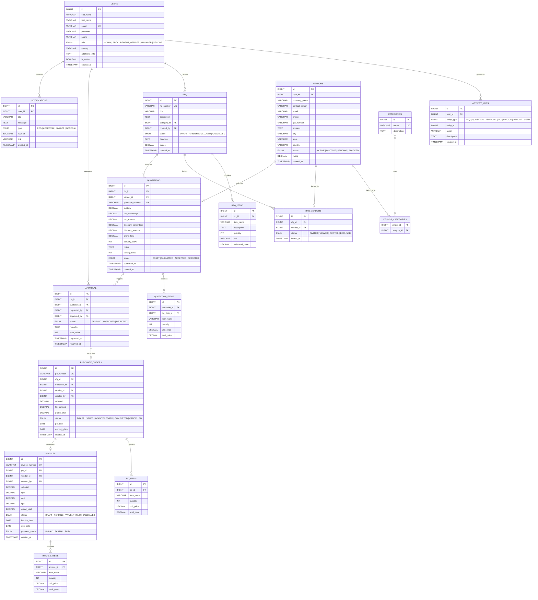

# VendorBridge

Procurement & Vendor Management ERP — a centralized platform to digitize and streamline procurement operations including vendor management, RFQs, quotations, approvals, purchase orders, and invoice generation.

---

## Tech Stack

| Layer | Technology |
|-------|------------|
| **Frontend** | React 18, React Router v6, Tailwind CSS v3, JavaScript (ES6+) |
| **Backend** | Java 21, Spring Boot 3, Spring Security, Spring Data JPA |
| **Authentication** | JWT (JSON Web Tokens) |
| **Database** | MySQL 8.0+ |
| **PDF Generation** | iText 7 |
| **Email** | Spring Boot Mail (JavaMailSender) |
| **Build Tools** | Vite (frontend), Maven (backend) |

---

## Team Responsibilities

| Member | Responsibilities |
|--------|-----------------|
| **Vrushti** | Database Design + Admin Module |
| **Priyanka** | Procurement Officer + Vendor Module |
| **Nisarg** | Frontend + Manager/Approver Module |

---

## ER Diagram

