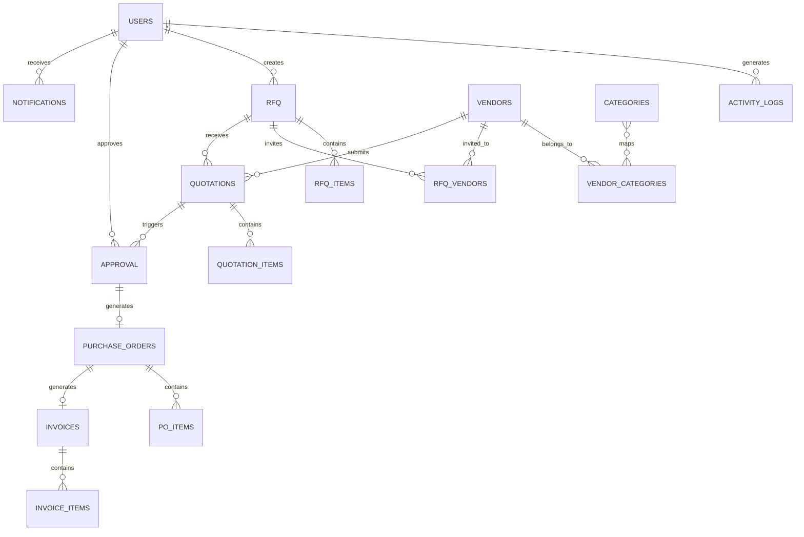

# VendorBridge — Procurement & Vendor Management ERP

A full-stack ERP platform to digitize procurement operations: manage vendors, RFQs, quotations, approvals, purchase orders, invoices, activity logs, and reports.

**Tech Stack**: React + Tailwind CSS (frontend) · Java 21 + Spring Boot + JWT (backend) · MySQL (database)

---

## User Review Required

> [!IMPORTANT]
> **Project Structure**: The plan creates two top-level folders inside `v:\Vrushti\Projects\Vendor Bridge\`:
> - `vendorbridge-backend/` — Spring Boot Maven project
> - `vendorbridge-frontend/` — React (Vite) project
>
> Please confirm this is acceptable, or suggest alternate paths.

> [!WARNING]
> **Email Sending**: The problem statement requires "Send invoice via email." This plan uses Spring Boot's `JavaMailSender`. You will need to provide SMTP credentials (e.g., Gmail App Password) in `application.properties` for this to work. We can stub it out initially if you prefer.

> [!IMPORTANT]
> **PDF Generation**: Invoice PDF download requires a library. This plan uses **iText 7** (free for open-source). Confirm if that's okay, or we can use Apache PDFBox instead.

---

## Open Questions

1. **Vendor self-registration**: Should vendors register themselves via the signup screen, or should only Admins create vendor accounts? The wireframe shows a registration screen with a "Role" dropdown — the plan assumes self-registration with Admin approval.
2. **Multi-tenancy**: Is this single-org or multi-org? Plan assumes **single organization**.
3. **MySQL version**: Any specific version? Plan targets MySQL 8.0+.
4. **Deployment**: Any deployment target (Docker, cloud)? Plan focuses on local dev for now.

---

## 1. Database Design (MySQL)

### ER Diagram



### Table Definitions

#### `users`
| Column | Type | Constraints |
|--------|------|-------------|
| id | BIGINT | PK, AUTO_INCREMENT |
| first_name | VARCHAR(100) | NOT NULL |
| last_name | VARCHAR(100) | NOT NULL |
| email | VARCHAR(255) | UNIQUE, NOT NULL |
| password | VARCHAR(255) | NOT NULL (bcrypt) |
| phone | VARCHAR(20) | |
| role | ENUM('ADMIN','PROCUREMENT_OFFICER','MANAGER','VENDOR') | NOT NULL |
| country | VARCHAR(100) | |
| additional_info | TEXT | |
| is_active | BOOLEAN | DEFAULT TRUE |
| profile_image_url | VARCHAR(500) | |
| created_at | TIMESTAMP | DEFAULT CURRENT_TIMESTAMP |
| updated_at | TIMESTAMP | ON UPDATE CURRENT_TIMESTAMP |

#### `vendors`
| Column | Type | Constraints |
|--------|------|-------------|
| id | BIGINT | PK, AUTO_INCREMENT |
| user_id | BIGINT | FK → users.id, NULLABLE (linked if vendor has login) |
| company_name | VARCHAR(255) | NOT NULL |
| contact_person | VARCHAR(200) | |
| email | VARCHAR(255) | NOT NULL |
| phone | VARCHAR(20) | |
| gst_number | VARCHAR(50) | |
| address | TEXT | |
| city | VARCHAR(100) | |
| state | VARCHAR(100) | |
| country | VARCHAR(100) | |
| pincode | VARCHAR(20) | |
| status | ENUM('ACTIVE','INACTIVE','PENDING','BLOCKED') | DEFAULT 'ACTIVE' |
| rating | DECIMAL(3,2) | DEFAULT 0.00 |
| created_at | TIMESTAMP | DEFAULT CURRENT_TIMESTAMP |
| updated_at | TIMESTAMP | ON UPDATE CURRENT_TIMESTAMP |

#### `categories`
| Column | Type | Constraints |
|--------|------|-------------|
| id | BIGINT | PK, AUTO_INCREMENT |
| name | VARCHAR(100) | UNIQUE, NOT NULL |
| description | TEXT | |

#### `vendor_categories` (junction table)
| Column | Type | Constraints |
|--------|------|-------------|
| vendor_id | BIGINT | FK → vendors.id, PK |
| category_id | BIGINT | FK → categories.id, PK |

#### `rfq` (Request for Quotation)
| Column | Type | Constraints |
|--------|------|-------------|
| id | BIGINT | PK, AUTO_INCREMENT |
| rfq_number | VARCHAR(50) | UNIQUE, NOT NULL (auto: RFQ-YYYYMMDD-XXXX) |
| title | VARCHAR(255) | NOT NULL |
| description | TEXT | |
| category_id | BIGINT | FK → categories.id |
| created_by | BIGINT | FK → users.id |
| status | ENUM('DRAFT','PUBLISHED','CLOSED','CANCELLED') | DEFAULT 'DRAFT' |
| deadline | DATE | NOT NULL |
| budget | DECIMAL(15,2) | |
| created_at | TIMESTAMP | DEFAULT CURRENT_TIMESTAMP |
| updated_at | TIMESTAMP | ON UPDATE CURRENT_TIMESTAMP |

#### `rfq_items`
| Column | Type | Constraints |
|--------|------|-------------|
| id | BIGINT | PK, AUTO_INCREMENT |
| rfq_id | BIGINT | FK → rfq.id |
| item_name | VARCHAR(255) | NOT NULL |
| description | TEXT | |
| quantity | INT | NOT NULL |
| unit | VARCHAR(50) | (e.g., pcs, kg, boxes) |
| estimated_price | DECIMAL(15,2) | |

#### `rfq_vendors` (which vendors are invited)
| Column | Type | Constraints |
|--------|------|-------------|
| id | BIGINT | PK, AUTO_INCREMENT |
| rfq_id | BIGINT | FK → rfq.id |
| vendor_id | BIGINT | FK → vendors.id |
| invited_at | TIMESTAMP | DEFAULT CURRENT_TIMESTAMP |
| status | ENUM('INVITED','VIEWED','QUOTED','DECLINED') | DEFAULT 'INVITED' |

#### `quotations`
| Column | Type | Constraints |
|--------|------|-------------|
| id | BIGINT | PK, AUTO_INCREMENT |
| rfq_id | BIGINT | FK → rfq.id |
| vendor_id | BIGINT | FK → vendors.id |
| quotation_number | VARCHAR(50) | UNIQUE |
| subtotal | DECIMAL(15,2) | |
| tax_percentage | DECIMAL(5,2) | |
| tax_amount | DECIMAL(15,2) | |
| discount_percentage | DECIMAL(5,2) | |
| discount_amount | DECIMAL(15,2) | |
| grand_total | DECIMAL(15,2) | |
| delivery_days | INT | |
| notes | TEXT | |
| validity_days | INT | DEFAULT 30 |
| status | ENUM('DRAFT','SUBMITTED','ACCEPTED','REJECTED') | DEFAULT 'DRAFT' |
| submitted_at | TIMESTAMP | |
| created_at | TIMESTAMP | DEFAULT CURRENT_TIMESTAMP |
| updated_at | TIMESTAMP | ON UPDATE CURRENT_TIMESTAMP |

#### `quotation_items`
| Column | Type | Constraints |
|--------|------|-------------|
| id | BIGINT | PK, AUTO_INCREMENT |
| quotation_id | BIGINT | FK → quotations.id |
| rfq_item_id | BIGINT | FK → rfq_items.id |
| item_name | VARCHAR(255) | NOT NULL |
| quantity | INT | |
| unit_price | DECIMAL(15,2) | |
| total_price | DECIMAL(15,2) | |

#### `approvals`
| Column | Type | Constraints |
|--------|------|-------------|
| id | BIGINT | PK, AUTO_INCREMENT |
| rfq_id | BIGINT | FK → rfq.id |
| quotation_id | BIGINT | FK → quotations.id |
| requested_by | BIGINT | FK → users.id |
| approved_by | BIGINT | FK → users.id, NULLABLE |
| status | ENUM('PENDING','APPROVED','REJECTED') | DEFAULT 'PENDING' |
| remarks | TEXT | |
| step_order | INT | DEFAULT 1 (multi-step workflow) |
| requested_at | TIMESTAMP | DEFAULT CURRENT_TIMESTAMP |
| resolved_at | TIMESTAMP | |

#### `purchase_orders`
| Column | Type | Constraints |
|--------|------|-------------|
| id | BIGINT | PK, AUTO_INCREMENT |
| po_number | VARCHAR(50) | UNIQUE, NOT NULL (auto: PO-YYYYMMDD-XXXX) |
| rfq_id | BIGINT | FK → rfq.id |
| quotation_id | BIGINT | FK → quotations.id |
| vendor_id | BIGINT | FK → vendors.id |
| created_by | BIGINT | FK → users.id |
| subtotal | DECIMAL(15,2) | |
| tax_amount | DECIMAL(15,2) | |
| grand_total | DECIMAL(15,2) | |
| status | ENUM('DRAFT','ISSUED','ACKNOWLEDGED','COMPLETED','CANCELLED') | DEFAULT 'DRAFT' |
| po_date | DATE | |
| delivery_date | DATE | |
| created_at | TIMESTAMP | DEFAULT CURRENT_TIMESTAMP |
| updated_at | TIMESTAMP | ON UPDATE CURRENT_TIMESTAMP |

#### `po_items`
| Column | Type | Constraints |
|--------|------|-------------|
| id | BIGINT | PK, AUTO_INCREMENT |
| po_id | BIGINT | FK → purchase_orders.id |
| item_name | VARCHAR(255) | NOT NULL |
| quantity | INT | |
| unit_price | DECIMAL(15,2) | |
| total_price | DECIMAL(15,2) | |

#### `invoices`
| Column | Type | Constraints |
|--------|------|-------------|
| id | BIGINT | PK, AUTO_INCREMENT |
| invoice_number | VARCHAR(50) | UNIQUE, NOT NULL (auto: INV-YYYYMMDD-XXXX) |
| po_id | BIGINT | FK → purchase_orders.id |
| vendor_id | BIGINT | FK → vendors.id |
| created_by | BIGINT | FK → users.id |
| subtotal | DECIMAL(15,2) | |
| sgst | DECIMAL(15,2) | |
| cgst | DECIMAL(15,2) | |
| igst | DECIMAL(15,2) | |
| grand_total | DECIMAL(15,2) | |
| status | ENUM('DRAFT','PENDING_PAYMENT','PAID','CANCELLED') | DEFAULT 'DRAFT' |
| invoice_date | DATE | |
| due_date | DATE | |
| payment_status | ENUM('UNPAID','PARTIAL','PAID') | DEFAULT 'UNPAID' |
| created_at | TIMESTAMP | DEFAULT CURRENT_TIMESTAMP |
| updated_at | TIMESTAMP | ON UPDATE CURRENT_TIMESTAMP |

#### `invoice_items`
| Column | Type | Constraints |
|--------|------|-------------|
| id | BIGINT | PK, AUTO_INCREMENT |
| invoice_id | BIGINT | FK → invoices.id |
| item_name | VARCHAR(255) | NOT NULL |
| quantity | INT | |
| unit_price | DECIMAL(15,2) | |
| total_price | DECIMAL(15,2) | |

#### `activity_logs`
| Column | Type | Constraints |
|--------|------|-------------|
| id | BIGINT | PK, AUTO_INCREMENT |
| user_id | BIGINT | FK → users.id |
| entity_type | ENUM('RFQ','QUOTATION','APPROVAL','PO','INVOICE','VENDOR','USER') | |
| entity_id | BIGINT | |
| action | VARCHAR(100) | (e.g., CREATED, UPDATED, APPROVED) |
| description | TEXT | |
| created_at | TIMESTAMP | DEFAULT CURRENT_TIMESTAMP |

#### `notifications`
| Column | Type | Constraints |
|--------|------|-------------|
| id | BIGINT | PK, AUTO_INCREMENT |
| user_id | BIGINT | FK → users.id |
| title | VARCHAR(255) | |
| message | TEXT | |
| type | ENUM('RFQ','APPROVAL','INVOICE','GENERAL') | |
| is_read | BOOLEAN | DEFAULT FALSE |
| link | VARCHAR(500) | (frontend route to navigate) |
| created_at | TIMESTAMP | DEFAULT CURRENT_TIMESTAMP |

---

## 2. Backend — Spring Boot REST API Plan

### Project Structure

```
vendorbridge-backend/
├── pom.xml
└── src/main/
    ├── java/com/vendorbridge/
    │   ├── VendorBridgeApplication.java
    │   ├── config/
    │   │   ├── SecurityConfig.java          # Spring Security + JWT filter chain
    │   │   ├── JwtAuthFilter.java           # OncePerRequestFilter
    │   │   ├── JwtService.java              # Token generation/validation
    │   │   ├── CorsConfig.java              # CORS for React dev server
    │   │   └── AppConfig.java               # BCrypt encoder, etc.
    │   ├── controller/
    │   │   ├── AuthController.java
    │   │   ├── UserController.java
    │   │   ├── VendorController.java
    │   │   ├── CategoryController.java
    │   │   ├── RfqController.java
    │   │   ├── QuotationController.java
    │   │   ├── ApprovalController.java
    │   │   ├── PurchaseOrderController.java
    │   │   ├── InvoiceController.java
    │   │   ├── ActivityLogController.java
    │   │   ├── NotificationController.java
    │   │   ├── ReportController.java
    │   │   └── DashboardController.java
    │   ├── service/
    │   │   ├── AuthService.java
    │   │   ├── UserService.java
    │   │   ├── VendorService.java
    │   │   ├── CategoryService.java
    │   │   ├── RfqService.java
    │   │   ├── QuotationService.java
    │   │   ├── ApprovalService.java
    │   │   ├── PurchaseOrderService.java
    │   │   ├── InvoiceService.java
    │   │   ├── PdfService.java              # iText 7 PDF generation
    │   │   ├── EmailService.java            # JavaMailSender
    │   │   ├── ActivityLogService.java
    │   │   ├── NotificationService.java
    │   │   ├── ReportService.java
    │   │   └── DashboardService.java
    │   ├── repository/
    │   │   ├── UserRepository.java
    │   │   ├── VendorRepository.java
    │   │   ├── CategoryRepository.java
    │   │   ├── RfqRepository.java
    │   │   ├── RfqItemRepository.java
    │   │   ├── RfqVendorRepository.java
    │   │   ├── QuotationRepository.java
    │   │   ├── QuotationItemRepository.java
    │   │   ├── ApprovalRepository.java
    │   │   ├── PurchaseOrderRepository.java
    │   │   ├── PoItemRepository.java
    │   │   ├── InvoiceRepository.java
    │   │   ├── InvoiceItemRepository.java
    │   │   ├── ActivityLogRepository.java
    │   │   └── NotificationRepository.java
    │   ├── entity/
    │   │   ├── User.java
    │   │   ├── Vendor.java
    │   │   ├── Category.java
    │   │   ├── Rfq.java
    │   │   ├── RfqItem.java
    │   │   ├── RfqVendor.java
    │   │   ├── Quotation.java
    │   │   ├── QuotationItem.java
    │   │   ├── Approval.java
    │   │   ├── PurchaseOrder.java
    │   │   ├── PoItem.java
    │   │   ├── Invoice.java
    │   │   ├── InvoiceItem.java
    │   │   ├── ActivityLog.java
    │   │   └── Notification.java
    │   ├── dto/
    │   │   ├── request/        # LoginRequest, RegisterRequest, CreateRfqRequest, etc.
    │   │   └── response/       # AuthResponse, DashboardResponse, ReportResponse, etc.
    │   ├── enums/
    │   │   ├── Role.java
    │   │   ├── RfqStatus.java
    │   │   ├── QuotationStatus.java
    │   │   ├── ApprovalStatus.java
    │   │   ├── PoStatus.java
    │   │   ├── InvoiceStatus.java
    │   │   ├── VendorStatus.java
    │   │   └── EntityType.java
    │   └── exception/
    │       ├── GlobalExceptionHandler.java  # @ControllerAdvice
    │       ├── ResourceNotFoundException.java
    │       └── UnauthorizedException.java
    └── resources/
        ├── application.properties
        └── data.sql                         # Seed data (categories, admin user)
```

### API Endpoints

#### Authentication (`/api/auth`)
| Method | Endpoint | Description | Access |
|--------|----------|-------------|--------|
| POST | `/api/auth/register` | Register new user | Public |
| POST | `/api/auth/login` | Login, returns JWT | Public |
| POST | `/api/auth/refresh` | Refresh JWT token | Authenticated |
| GET | `/api/auth/me` | Get current user profile | Authenticated |

#### Users (`/api/users`)
| Method | Endpoint | Description | Access |
|--------|----------|-------------|--------|
| GET | `/api/users` | List all users (paginated) | ADMIN |
| GET | `/api/users/{id}` | Get user by ID | ADMIN |
| PUT | `/api/users/{id}` | Update user | ADMIN / Self |
| DELETE | `/api/users/{id}` | Deactivate user | ADMIN |
| PUT | `/api/users/{id}/role` | Change user role | ADMIN |

#### Vendors (`/api/vendors`)
| Method | Endpoint | Description | Access |
|--------|----------|-------------|--------|
| GET | `/api/vendors` | List vendors (search, filter, paginate) | Authenticated |
| GET | `/api/vendors/{id}` | Get vendor details | Authenticated |
| POST | `/api/vendors` | Create vendor | ADMIN, PROCUREMENT_OFFICER |
| PUT | `/api/vendors/{id}` | Update vendor | ADMIN, PROCUREMENT_OFFICER |
| DELETE | `/api/vendors/{id}` | Deactivate vendor | ADMIN |
| PATCH | `/api/vendors/{id}/status` | Change vendor status | ADMIN |
| GET | `/api/vendors/{id}/quotations` | Vendor's quotation history | Authenticated |

#### Categories (`/api/categories`)
| Method | Endpoint | Description | Access |
|--------|----------|-------------|--------|
| GET | `/api/categories` | List all categories | Authenticated |
| POST | `/api/categories` | Create category | ADMIN |
| PUT | `/api/categories/{id}` | Update category | ADMIN |
| DELETE | `/api/categories/{id}` | Delete category | ADMIN |

#### RFQs (`/api/rfqs`)
| Method | Endpoint | Description | Access |
|--------|----------|-------------|--------|
| GET | `/api/rfqs` | List RFQs (filter by status, search) | Authenticated |
| GET | `/api/rfqs/{id}` | Get RFQ details with items & vendors | Authenticated |
| POST | `/api/rfqs` | Create RFQ (with items & vendor assignments) | PROCUREMENT_OFFICER |
| PUT | `/api/rfqs/{id}` | Update RFQ | PROCUREMENT_OFFICER |
| PATCH | `/api/rfqs/{id}/status` | Change RFQ status (publish, close) | PROCUREMENT_OFFICER |
| DELETE | `/api/rfqs/{id}` | Delete draft RFQ | PROCUREMENT_OFFICER |
| GET | `/api/rfqs/vendor/{vendorId}` | RFQs assigned to a vendor | VENDOR |
| POST | `/api/rfqs/{id}/attachments` | Upload RFQ attachments | PROCUREMENT_OFFICER |

#### Quotations (`/api/quotations`)
| Method | Endpoint | Description | Access |
|--------|----------|-------------|--------|
| GET | `/api/quotations` | List quotations | Authenticated |
| GET | `/api/quotations/{id}` | Get quotation details | Authenticated |
| POST | `/api/quotations` | Submit quotation for an RFQ | VENDOR |
| PUT | `/api/quotations/{id}` | Update draft quotation | VENDOR |
| PATCH | `/api/quotations/{id}/submit` | Submit quotation (change status) | VENDOR |
| GET | `/api/quotations/rfq/{rfqId}` | All quotations for an RFQ | PROCUREMENT_OFFICER, MANAGER |
| GET | `/api/quotations/rfq/{rfqId}/compare` | Side-by-side comparison data | PROCUREMENT_OFFICER, MANAGER |
| PATCH | `/api/quotations/{id}/select` | Select quotation → triggers approval | PROCUREMENT_OFFICER |

#### Approvals (`/api/approvals`)
| Method | Endpoint | Description | Access |
|--------|----------|-------------|--------|
| GET | `/api/approvals` | List pending approvals | MANAGER, ADMIN |
| GET | `/api/approvals/{id}` | Get approval details | Authenticated |
| POST | `/api/approvals` | Create approval request | PROCUREMENT_OFFICER |
| PATCH | `/api/approvals/{id}/approve` | Approve request | MANAGER |
| PATCH | `/api/approvals/{id}/reject` | Reject request (with remarks) | MANAGER |
| GET | `/api/approvals/rfq/{rfqId}` | Approval history for an RFQ | Authenticated |

#### Purchase Orders (`/api/purchase-orders`)
| Method | Endpoint | Description | Access |
|--------|----------|-------------|--------|
| GET | `/api/purchase-orders` | List POs | Authenticated |
| GET | `/api/purchase-orders/{id}` | Get PO details | Authenticated |
| POST | `/api/purchase-orders/generate` | Auto-generate PO from approval | PROCUREMENT_OFFICER |
| PATCH | `/api/purchase-orders/{id}/status` | Update PO status | PROCUREMENT_OFFICER |
| GET | `/api/purchase-orders/{id}/pdf` | Download PO as PDF | Authenticated |

#### Invoices (`/api/invoices`)
| Method | Endpoint | Description | Access |
|--------|----------|-------------|--------|
| GET | `/api/invoices` | List invoices | Authenticated |
| GET | `/api/invoices/{id}` | Get invoice details | Authenticated |
| POST | `/api/invoices/generate` | Generate invoice from PO | PROCUREMENT_OFFICER |
| PATCH | `/api/invoices/{id}/status` | Update invoice/payment status | PROCUREMENT_OFFICER, ADMIN |
| GET | `/api/invoices/{id}/pdf` | Download invoice PDF | Authenticated |
| POST | `/api/invoices/{id}/print` | Print invoice | Authenticated |
| POST | `/api/invoices/{id}/email` | Email invoice to vendor | PROCUREMENT_OFFICER |

#### Dashboard (`/api/dashboard`)
| Method | Endpoint | Description | Access |
|--------|----------|-------------|--------|
| GET | `/api/dashboard/stats` | Summary cards (active RFQs, pending approvals, etc.) | Authenticated |
| GET | `/api/dashboard/recent-pos` | Recent purchase orders | Authenticated |
| GET | `/api/dashboard/recent-invoices` | Recent invoices | Authenticated |
| GET | `/api/dashboard/chart-data` | Chart data for dashboard | Authenticated |

#### Activity Logs (`/api/activity-logs`)
| Method | Endpoint | Description | Access |
|--------|----------|-------------|--------|
| GET | `/api/activity-logs` | List activity logs (filter by type) | Authenticated |
| GET | `/api/activity-logs/entity/{type}/{id}` | Logs for specific entity | Authenticated |

#### Notifications (`/api/notifications`)
| Method | Endpoint | Description | Access |
|--------|----------|-------------|--------|
| GET | `/api/notifications` | List user notifications | Authenticated |
| PATCH | `/api/notifications/{id}/read` | Mark as read | Authenticated |
| PATCH | `/api/notifications/read-all` | Mark all as read | Authenticated |
| GET | `/api/notifications/unread-count` | Get unread count | Authenticated |

#### Reports (`/api/reports`)
| Method | Endpoint | Description | Access |
|--------|----------|-------------|--------|
| GET | `/api/reports/procurement-stats` | Procurement statistics | ADMIN, PROCUREMENT_OFFICER |
| GET | `/api/reports/spending-by-category` | Spending by category | ADMIN, PROCUREMENT_OFFICER |
| GET | `/api/reports/top-vendors` | Top vendors by spend | ADMIN, PROCUREMENT_OFFICER |
| GET | `/api/reports/monthly-trends` | Monthly procurement trends | ADMIN, PROCUREMENT_OFFICER |
| GET | `/api/reports/export` | Export report as CSV/Excel | ADMIN, PROCUREMENT_OFFICER |

### Authentication Flow
1. User registers → password bcrypt-hashed → stored in `users` table
2. User logs in → credentials validated → JWT access token returned (24h expiry)
3. Every request includes `Authorization: Bearer <token>` header
4. `JwtAuthFilter` extracts token, validates, sets `SecurityContext`
5. `@PreAuthorize` annotations enforce role-based access on controller methods

### Key Dependencies (pom.xml)
- `spring-boot-starter-web`
- `spring-boot-starter-data-jpa`
- `spring-boot-starter-security`
- `spring-boot-starter-validation`
- `spring-boot-starter-mail`
- `mysql-connector-j`
- `jjwt-api`, `jjwt-impl`, `jjwt-jackson` (io.jsonwebtoken 0.12.x)
- `itext7-core` (PDF generation)
- `lombok`

---

## 3. Frontend — React Implementation Plan

### Project Setup
- **Vite** with React template (JavaScript)
- **Tailwind CSS v3** for styling
- **React Router v6** for routing
- **State management**: `useState`, `useEffect`, `useContext` (AuthContext)
- **HTTP**: Native `fetch` API with a custom `apiClient` wrapper

### Project Structure

```
vendorbridge-frontend/
├── index.html
├── package.json
├── vite.config.js
├── tailwind.config.js
├── postcss.config.js
└── src/
    ├── main.jsx                    # Entry point, Router setup
    ├── App.jsx                     # Route definitions
    ├── index.css                   # Tailwind directives + custom styles
    ├── api/
    │   └── apiClient.js            # fetch wrapper with JWT headers
    ├── context/
    │   └── AuthContext.jsx         # Auth state, login/logout, token mgmt
    ├── hooks/
    │   ├── useAuth.js              # useContext(AuthContext)
    │   ├── useFetch.js             # Generic data fetching hook
    │   └── useNotifications.js     # Notification polling
    ├── components/
    │   ├── layout/
    │   │   ├── Sidebar.jsx         # Left nav with menu items
    │   │   ├── TopBar.jsx          # Header with notifications bell, user avatar
    │   │   ├── MainLayout.jsx      # Sidebar + TopBar + Outlet
    │   │   └── ProtectedRoute.jsx  # Auth guard + role check
    │   ├── common/
    │   │   ├── Button.jsx
    │   │   ├── Input.jsx
    │   │   ├── Modal.jsx
    │   │   ├── Table.jsx
    │   │   ├── StatusBadge.jsx
    │   │   ├── Card.jsx
    │   │   ├── Loader.jsx
    │   │   ├── Pagination.jsx
    │   │   ├── SearchBar.jsx
    │   │   ├── FilterTabs.jsx
    │   │   ├── EmptyState.jsx
    │   │   └── ConfirmDialog.jsx
    │   ├── dashboard/
    │   │   ├── StatsCard.jsx
    │   │   ├── RecentPurchaseTable.jsx
    │   │   └── DashboardChart.jsx
    │   ├── vendors/
    │   │   ├── VendorCard.jsx
    │   │   └── VendorForm.jsx
    │   ├── rfq/
    │   │   ├── RfqItemRow.jsx
    │   │   ├── RfqVendorSelect.jsx
    │   │   └── RfqStepper.jsx      # 3-step creation wizard
    │   ├── quotations/
    │   │   ├── QuotationForm.jsx
    │   │   ├── ComparisonTable.jsx
    │   │   └── QuotationRow.jsx
    │   ├── approvals/
    │   │   ├── ApprovalTimeline.jsx
    │   │   └── ApprovalActions.jsx
    │   ├── invoices/
    │   │   ├── InvoicePreview.jsx
    │   │   └── InvoiceLineItems.jsx
    │   └── reports/
    │       ├── SpendChart.jsx
    │       ├── TrendChart.jsx
    │       └── TopVendorsTable.jsx
    └── pages/
        ├── auth/
        │   ├── LoginPage.jsx        # Screen 1
        │   └── RegisterPage.jsx     # Screen 2
        ├── DashboardPage.jsx        # Screen 3
        ├── vendors/
        │   ├── VendorsListPage.jsx  # Screen 4
        │   └── VendorDetailPage.jsx
        ├── rfq/
        │   ├── RfqListPage.jsx      # Screen 5 (list)
        │   └── RfqCreatePage.jsx    # Screen 5 (create wizard)
        ├── quotations/
        │   ├── QuotationSubmitPage.jsx    # Screen 6
        │   └── QuotationComparePage.jsx   # Screen 7
        ├── approvals/
        │   └── ApprovalPage.jsx     # Screen 8
        ├── purchaseorders/
        │   ├── PoListPage.jsx
        │   └── PoInvoicePage.jsx    # Screen 9
        ├── ActivityPage.jsx         # Screen 10
        └── ReportsPage.jsx          # Screen 11
```

### Routing Plan

| Path | Component | Access |
|------|-----------|--------|
| `/login` | LoginPage | Public |
| `/register` | RegisterPage | Public |
| `/` | DashboardPage | All authenticated |
| `/vendors` | VendorsListPage | ADMIN, PROCUREMENT_OFFICER |
| `/vendors/:id` | VendorDetailPage | ADMIN, PROCUREMENT_OFFICER |
| `/rfqs` | RfqListPage | PROCUREMENT_OFFICER, VENDOR |
| `/rfqs/create` | RfqCreatePage | PROCUREMENT_OFFICER |
| `/rfqs/:id` | RfqDetailPage | Authenticated |
| `/quotations/submit/:rfqId` | QuotationSubmitPage | VENDOR |
| `/quotations/compare/:rfqId` | QuotationComparePage | PROCUREMENT_OFFICER, MANAGER |
| `/approvals` | ApprovalPage | MANAGER, ADMIN |
| `/approvals/:id` | ApprovalPage (detail) | MANAGER, ADMIN |
| `/purchase-orders` | PoListPage | Authenticated |
| `/purchase-orders/:id` | PoInvoicePage | Authenticated |
| `/invoices` | InvoiceListPage | Authenticated |
| `/invoices/:id` | InvoicePage | Authenticated |
| `/activity` | ActivityPage | Authenticated |
| `/reports` | ReportsPage | ADMIN, PROCUREMENT_OFFICER |

### Screen Implementation Details

#### Screen 1 & 2 — Login / Register
- Centered card with logo, dark themed
- Form validation with inline errors
- Role selector dropdown on register page
- After login → store JWT in `localStorage`, redirect to Dashboard

#### Screen 3 — Dashboard
- Welcome banner with user name & role
- 4 stat cards: Active RFQs, Pending Approvals, Total Spend, Vendor Count
- Recent purchase orders table
- Quick-action buttons: "+ New RFQ", "Add Vendor", "View Invoices"
- Simple bar/line chart (using lightweight Chart.js or canvas-based)

#### Screen 4 — Vendors
- "+ Add Vendor" button top-right
- Search bar + filter tabs (All, Active, Inactive, Pending, Blocked)
- Table with columns: Vendor Name, Category, GST No., Contact, Phone, Status
- Click row → Vendor detail page
- Add/Edit vendor modal form

#### Screen 5 — RFQ Creation (3-step wizard)
- **Step 1**: RFQ details (title, category, budget, deadline, description)
- **Step 2**: Add line items (item name, qty, unit, estimated price) — dynamic rows
- **Step 3**: Select vendors to invite + add attachments
- Stepper UI with progress indicator (matching wireframe)
- "Save & Send to Vendors" / "Save as Draft" buttons

#### Screen 6 — Quotation Submission (Vendor view)
- Shows RFQ details at top
- Line items pre-filled from RFQ, vendor fills unit price
- Tax %, freight, discount fields
- Subtotal / Grand Total auto-calculated
- "Attach Warranty" / "Save Draft" / "Submit" buttons

#### Screen 7 — Quotation Comparison
- RFQ info header
- Side-by-side comparison table (each vendor = column)
- Rows: Price, Delivery Days, Warranty, Payment Terms, Rating
- Lowest price highlighted in green
- "Select & Approve" and "Reject" buttons per vendor

#### Screen 8 — Approval Workflow
- RFQ and Quotation summary
- 3-step approval timeline (visual stepper: 1→2→3)
- Approval chain with names and statuses
- Quotation summary sidebar
- Remarks textarea
- Approve / Reject buttons

#### Screen 9 — Purchase Order & Invoice
- PO details header with status tabs (PO / Invoice / Email)
- Buyer & Vendor info cards
- Line items table with tax calculations
- Status: "Pending Payment" / "Mark as Paid"
- Action buttons: Download PDF, Print, Send Email

#### Screen 10 — Activity & Logs
- Filter tabs: All, RFQs, Approvals, Invoices, Vendors
- Timeline-style activity log with icons
- Each entry shows: action, entity, user, timestamp
- Search/filter capabilities

#### Screen 11 — Reports & Analytics
- Date range selector + Export button
- 4 stat cards: Total Spend, Active Vendors, RFQ Fulfillment %, Vendor Issues
- "Spend by Category" horizontal bar chart
- "Top Vendors by Spend" table
- "Monthly Trend" bar chart

### Design System (Tailwind Theme)
- **Dark theme** as primary (matching the wireframe's dark background)
- Color palette:
  - Background: `#0a0a0f`, `#111118`, `#1a1a24`
  - Sidebar: `#0d0d14` with active item highlight in teal/green
  - Primary accent: Teal/Green (`#10b981`, `#14b8a6`)
  - Danger: Red (`#ef4444`)
  - Warning: Amber (`#f59e0b`)
  - Cards: Dark glass with subtle border (`border-gray-800`)
  - Text: White primary, gray-400 secondary
- Typography: Inter font family
- Border radius: Rounded-lg for cards, rounded-md for inputs

---

## 4. Proposed Implementation Order

### Phase 1: Project Setup & Foundation (both projects)
- [x] Initialize Spring Boot project with Maven
- [x] Initialize React + Vite project with Tailwind CSS
- [x] Database schema creation (SQL migration)
- [x] Spring Security + JWT configuration
- [x] React auth context, API client, routing shell

### Phase 2: Auth & User Management
- Auth controller (login, register)
- User entity & repository
- Login & Register pages (React)
- Protected routes & role guards

### Phase 3: Vendor Management
- Vendor CRUD APIs
- Category APIs
- Vendors list page + Add/Edit vendor form

### Phase 4: RFQ Module
- RFQ CRUD APIs with items and vendor assignments
- RFQ list page + 3-step creation wizard
- RFQ detail page

### Phase 5: Quotation Module
- Quotation submission APIs
- Quotation comparison API
- Quotation submit page (vendor view)
- Comparison page (procurement view)

### Phase 6: Approval Workflow
- Approval APIs (create, approve, reject)
- Approval page with timeline stepper

### Phase 7: PO & Invoice
- PO generation from approved quotation
- Invoice generation from PO
- PDF generation service
- Email sending service
- PO/Invoice pages

### Phase 8: Activity Logs, Notifications & Reports
- Activity log recording (AOP/service layer)
- Notification APIs
- Activity page
- Reports API with aggregation queries
- Reports page with charts

---

## 5. Verification Plan

### Automated Tests
```bash
# Backend - run from vendorbridge-backend/
mvn test

# Frontend - build check
cd vendorbridge-frontend && npm run build
```

### Manual Verification
1. **Auth flow**: Register user → Login → Verify JWT → Access protected routes
2. **Vendor CRUD**: Create, list, filter, edit, deactivate vendors
3. **RFQ workflow**: Create RFQ → Assign vendors → Publish
4. **Quotation flow**: Vendor submits quotation → Procurement compares → Selects winner
5. **Approval**: Selected quotation triggers approval → Manager approves
6. **PO/Invoice**: Auto-generate PO → Generate Invoice → Download PDF → Email
7. **Activity logs**: Verify all actions are logged
8. **Reports**: Check dashboard stats, charts, and CSV export
9. **Role-based access**: Verify each role can only access permitted features
10. **Responsive UI**: Check all screens match the wireframe design
