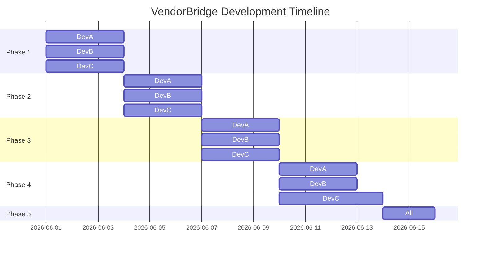

# VendorBridge — 4-Hour Hackathon Simple Work Distribution

This is a simplified, non-blocking work distribution for **3 developers** to complete the project in **4 hours**. Each developer owns a specific vertical area of the application end-to-end (backend API + frontend integration).

---

## 👥 The Simplified Roles

* **Developer A (Dev A) — Auth, Users & Dashboard**: Setup backend project, Security/JWT, Signup/Login, and Dashboard cards.
* **Developer B (Dev B) — Vendors & RFQs**: Vendor directory, Category lists, RFQ creation, and RFQ lists.
* **Developer C (Dev C) — Quotations, Approvals & PO/Invoices**: Quotation submission, manager approval, PO/Invoice generation, PDF downloads, and email sending.

---

## 📅 Timeline & Phases



---

## 🛠️ Simplified Task List per Developer

### 🟦 Dev A (Auth & Dashboard)
* **Phase 1 (Foundation)**: 
  * Initialize Spring Boot project (Web, JPA, MySQL, Security, Mail).
  * Configure `application.properties` (database connectivity + JWT secret).
* **Phase 2 (Auth Link)**:
  * Create `User` entity, `UserRepository`, and write Auth APIs (`/api/auth/register`, `/api/auth/login`).
  * Connect React frontend (`apiClient.js` & `AuthContext.jsx`) to point to the backend auth APIs.
* **Phase 3 (Platform Health)**:
  * Implement `ActivityLog` & `Notification` tables and simple logging/polling APIs.
* **Phase 4 (Dashboard & Analytics)**:
  * Implement simple `/api/dashboard/stats` endpoint returning counts (active RFQs, vendors, pending approvals).
  * Bind stats cards on React `DashboardPage` to real backend metrics.
* **Phase 5 (E2E Integration)**: Verify role-based routing (Admin, Procurement, Manager, Vendor) on the frontend.

---

### 🟩 Dev B (Vendors & RFQs)
* **Phase 1 (Foundation)**:
  * Create `Category` and `Vendor` entities and repositories.
  * Setup MySQL database schemas for categories & vendors.
* **Phase 2 (Core Forms)**:
  * Implement CRUD endpoints for Categories and Vendors (`/api/categories`, `/api/vendors`).
  * Connect React `VendorsListPage` and Add/Edit Vendor modals to the backend.
* **Phase 3 (RFQ Setup)**:
  * Create `Rfq` and `RfqItem` entities and schemas.
  * Write RFQ creation API (`POST /api/rfqs`) and RFQ list API (`GET /api/rfqs`).
* **Phase 4 (RFQ Integration)**:
  * Link React `RfqCreatePage` (3-step wizard) and `RFQListPage` to the backend.
* **Phase 5 (E2E Integration)**: Test vendor directory filters and full RFQ publishing flow.

---

### 🟨 Dev C (Quotations, Approvals & PO/Invoices)
* **Phase 1 (Foundation)**:
  * Create database tables for `Quotation`, `QuotationItem`, `Approval`, `PurchaseOrder`, `Invoice`.
* **Phase 2 (Bidding)**:
  * Implement Quotation Submission API (`POST /api/quotations`).
  * Connect React `QuotationSubmitPage` (Vendor view) to submit quotation bids.
* **Phase 3 (Approvals)**:
  * Implement Quotation Comparison API (`GET /api/quotations/rfq/{rfqId}/compare`).
  * Implement Approval APIs (`PATCH /api/approvals/{id}/approve` / `reject`).
  * Connect React `QuotationComparePage` and `ApprovalsPage` timelines.
* **Phase 4 (PO, Invoices & SMTP)**:
  * Implement PO and Invoice auto-generation API.
  * Integrate **OpenPDF** library for downloading PO/Invoice PDFs.
  * Integrate **JavaMailSender** (using your SMTP credentials) to email invoices.
  * Connect React PO/Invoice screens to download PDFs and trigger emails.
* **Phase 5 (E2E Integration)**: Verify complete bid selection -> approval -> PO -> invoice -> email flow.

---

## 📈 The Hour-by-Hour Collaborative Workline

To prevent blocking, the team should follow this precise timeline and check-in sequence:

```
[00:00] Start 🚀
   │
   ├── [00:30] Check-in 1: Repo Setup & Local DB Tables configured
   │
   ├── [01:30] Check-in 2: Auth APIs merged -> Security checks enabled on all endpoints
   │
   ├── [02:30] Check-in 3: E2E Bidding works (Register User -> Create RFQ -> Submit Quotation)
   │
   ├── [03:30] Check-in 4: Workflows complete (Select Quotation -> Approve PO/Invoice -> Send Email)
   │
   └── [04:00] Finish 🏁: Full Dry Run and Demo Preparation
```

### 🕐 Hour 0.0 - 0.5: Bootstrap & Database Tables
* **Dev A**: Initializes the Spring Boot maven project, sets up standard project folders, pushes code to Git.
* **Dev B** & **Dev C**: Git clone the baseline, set up local MySQL database connection, and execute SQL scripts to create base tables (`users`, `vendors`, `rfq`, `quotations`, etc.).
* **🤝 Sync Checkpoint (00:30)**: Make sure all three developers have the backend running locally and can successfully connect to their local MySQL databases.

### 🕑 Hour 0.5 - 1.5: Auth APIs & Basic Catalogs
* **Dev A**: Builds User Registration/Login APIs and configures JWT filter.
* **Dev B**: Writes Categories and Vendors CRUD endpoints.
* **Dev C**: Writes the entities/repositories for RFQs & Quotations.
* **🤝 Sync Checkpoint (01:30)**: **Dev A** merges the Auth/Security branch. **Dev B** and **Dev C** pull `main`, test login/token receipt, and add `@PreAuthorize` guards on their controller classes.

### 🕒 Hour 1.5 - 2.5: The Core Bidding Loop
* **Dev A**: Updates the React Frontend (`AuthContext.jsx` and `apiClient.js`) to point to the backend auth and replaces mock forms on Login/Register screens.
* **Dev B**: Implements the RFQ creation API (creating the RFQ and line items) and binds the frontend 3-step wizard.
* **Dev C**: Implements the Quotation Submission API and connects the vendor's bid page.
* **🤝 Sync Checkpoint (02:30)**: Test: Register a vendor -> Create RFQ -> Submit bid. The records must successfully persist and link together in the database.

### 🕓 Hour 2.5 - 3.5: Approvals & PDF Document Delivery
* **Dev A**: Implements Notifications and Activity Log services.
* **Dev B**: Implements the Quotation Compare and Selection APIs. Connects the frontend side-by-side comparison page.
* **Dev C**: Implements Approval workflows, auto-generates PO & Invoice records, integrates **OpenPDF** for PDF output, and connects the SMTP mail sender.
* **🤝 Sync Checkpoint (03:30)**: Test: Select a quotation -> Approve selection -> Auto-generate PO/Invoice -> Download PDF -> Receive SMTP email with the invoice attached.

### 🕔 Hour 3.5 - 4.0: Dashboard Cards & Final Polish
* **Dev A**: Writes Dashboard metrics API and binds frontend home cards to live database numbers.
* **Dev B**: Connects Notification counts and Activity timelines.
* **Dev C**: Polishes the invoice print page and checks PDF styling.
* **🤝 Sync Checkpoint (04:00)**: Perform one final end-to-end dry run of the application roles (Admin, Procurement, Manager, Vendor) to prepare for your demo.
